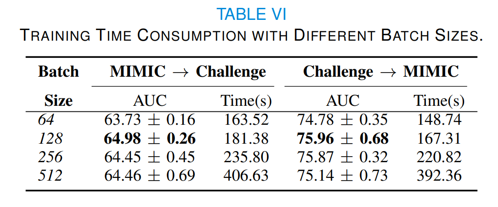

# SPSSOT
code of "Semi-supervised Optimal Transport withSelf-paced Ensemble for Cross-hospital SepsisEarly Detection"

## Requirements
We run the code with Python 3.8, tensorflow 2.4.

All the requirements have been listed in `requirements.txt`.


## Dataset & Preprocessing
Here we give the data link and preprocessing method.

**Basic idea**： 
- calculate the max, min, mean, std, last of all clinical indicators in 6 hours
- select patients whose missing features percentage is below 20% 

### MIMIC-III
link: https://physionet.org/content/mimiciii/1.4/

Sepsis labeling: https://github.com/alistairewj/sepsis3-mimic

### Challenge
data link: https://physionet.org/content/challenge-2019/1.0.0/


After preprocessing, data can be placed under `data` file. Taking `mimic` as an example, subfile `1-79` means the percentage of labeled data is 1% and unlabeled data is 79%, while mimic_test.csv means the data for testing.    

## Run SPSSOT
 ```python
 python SPSSOT_run.py --percent 1-79 --source challenge --target mimic --gloss 0.5 --sloss 1.0 --closs 0.15 --ot_alpha 0.1
```
where 
- `percent`: file name which means the percentage of labeled / unlabeled target data
- `source`: source data
- `target`: target data
- `gloss`: the weight of group entropic loss
- `sloss`: the weight of target classification loss
- `closs`: the weight of centroid untilization
- `ot_alpha`: the weight of optimal transport



