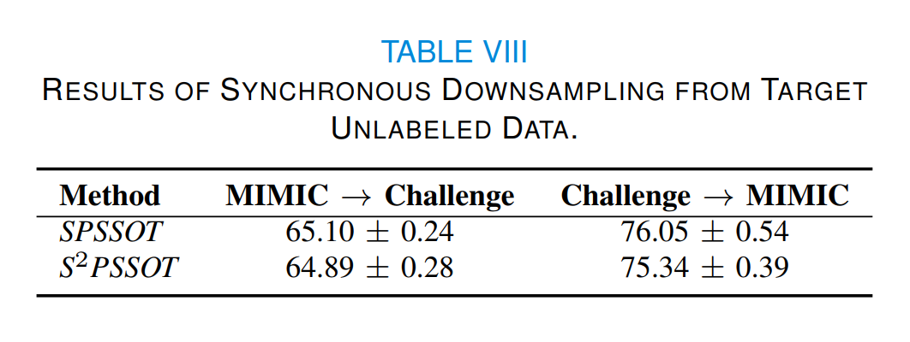

# SPSSOT

Semi-supervised Optimal Transport withSelf-paced Ensemble for Cross-hospital SepsisEarly Detection

## Supplemental Results (Appendix)

### A. Time Consumption

**Table VI** reports the training time consumption and AUC values of *SPSSOT* with different batch sizes. Though the optimal transport algorithm and the group entropic loss calculation have high complexity (super-quadratically with the size of the sample), the training usually takes only a few minutes because of the multiple rounds of minibatch iterative optimization [1,2]. Therefore, we can find that as the batch size increases, the training time increases, but the AUC value does not change significantly. In other words, a larger batch size does not necessarily lead to a higher yield. Therefore, we choose 128 as the batch size of *SPSSOT*.

At the same time, **Table VII** compares the training time of different semi-supervised transfer learning methods. The time consumption of our method is comparable to that of baselines. Considering that our method can achieve the best performance, such time consumption is generally acceptable in practice.


### B. Downsampling from Target Unlabeled Data

In *SPSSOT*, we only consider obtaining balanced training data from the source and target labeled data. Here we further explore whether downsampling the unlabeled data is effective. Based on the widely-used stratified sampling technique [3], we design a strategy to downsample the labeled and unlabeled data simultaneously: i) iterate 1000 times with all the data to obtain the initialized base classifier *SSOT* (i.e., Algorithm 1); ii) obtain the prediction probability of 79% unlabeled data by the base classifier, then split them into 10 bins and keep the proportion of the sampled data in each bin is consistent with the downsampled labeled data; iii) iteratively train 1000 times with the downsampled data and go back to step ii) (repeat 5 times).

As illustrated in **Table VIII**, there is no significant change. The possible reason is that the prediction probability of the unlabeled data is imprecise and thus the downsampling cannot reach the ideal data balancing effect. We believe how to deal with unlabeled samples reasonably worthy of further exploration.

   


### C. Outlier disturbance

The self-paced sampling in *SPSSOT* has filtered out some noise samples through self-paced hardness harmonization. In general, the outliers would not affect the calculation of class centers.
To confirm this, we also use a popular outlier detection algorithm, the isolation forest algorithm [4], to filter out the outliers before calculating the class centers.
As shown in Table \ref{tab:class center}, adding an explicit step of outlier removal has no noticeable effect on the results. Thus, as expected, the outliers do not seriously affect the accuracy of the calculation of class centers in *SPSSOT*.


### D. Adjusting the Label Adaptive Constraint

same label.
To relax this constraint, we adjust the label adaptive matrix $\mathcal{R}$ in Eq.(3), i.e.,

$$
\mathcal{R}(x^{t},x^{s}) = \begin{cases}
    \rho + (1-\rho) \cdot |y(x^{s}) - y(x^{t})| \in \{\rho, 1\}, & (x^{t}, y^{t}) \in \mathcal{D}^{l} \\
    \rho + (1-\rho) \cdot |y(x^{s}) - \hat{y}(x^{t})| \in [\rho, 1], & x^{t} \in \mathcal{D}^{u}
    \end{cases}
$$

Through the parameter, $\rho$, we can adjust the transport cost between two samples with the same label; especially when $\rho = 0$, the transport cost is 0; when $\rho =1$, the transport cost is calculated only according to the similarity of features (same as the unsupervised setting). We set $\rho = \{0, 0.05, 0.1, 0.2, 0.3, 0.4, 0.5\}$ and conduct experiments. The results are shown in **Table X**. It can be observed that when $\rho$ is small (between 0 to 0.1), the performance is better and relatively stable; then as $\rho$ increases, the AUC shows a slow downward trend. This indicates that in our task, it is better to set a small value to $\rho$, and setting $\rho = 0$ (i.e., ignoring the transport cost if two samples have the same label) is also reasonable.


### E. Unmatched Features

In *SPSSOT*, we filter out the shared features of two domains (listed in Table I) and adopt a domain-shared feature generator $\mathcal{G}$. However, both datasets have their own private features, which are listed in **Table XI**.


Considering target private features may be helpful to the target classification task, we design new network structures to incorporate these features: i) add a feature encoder $\mathcal{G}_{pri}$ for private features (the structure is the same as $\mathcal{G}$); ii) concatenate the output of $\mathcal{G}_{pri}$ and the output of $\mathcal{F}$'s first layer; iii) take the concatenation as the input of a new target classifier $\mathcal{F}$.After training *SPSSOT*, we transfer the parameters of *SPSSOT* and randomly initialize parameters in other components, and then update parameters with the target labeled data. In brief, we finetune *SPSSOT* by the target labeled data with full features (i.e., shared and private features). As illustrated in **Table XII**, we can find that there is an improvement in Challenge$\to$MIMIC while a slight change in MIMIC$\to$Challenge. This may be because Challenge only has two private features which are not important.


As for the source private features, it is difficult to transfer by optimal transport because there are no corresponding features in the target domain, which is worth to explore in the future, like using distillation learning to sufficiently extract useful information from the source domain [5].

### Reference

[1] Deepjdot: Deep joint distribution optimal transport for unsupervised domain adaptation, ECCV (2018).
[2] Reliable weighted optimal transport for unsupervised domain adaptation, CVPR (2020).
[3] Parsons, Van L. "Stratified sampling." Statistics Reference Online (2014).
[4] Liu, Fei Tony, et al. "Isolation forest." ICDM (2008).
[5] Ma, Liantao, et al. "Distilling knowledge from publicly available online emr data to emerging epidemic for prognosis." WWW (2021).


## Run Model ([Github](https://github.com/RuiqingDing/SPSSOT))

### Requirements

We run the code with Python 3.8, tensorflow 2.4.

All the requirements have been listed in `requirements.txt`.

### Dataset & Preprocessing

Here we give the data link and preprocessing method.

**Basic idea**：

- calculate the max, min, mean, std, last of all clinical indicators in 6 hours
- select patients whose missing features percentage is below 20%

#### MIMIC-III

link: https://physionet.org/content/mimiciii/1.4/

Sepsis labeling: https://github.com/alistairewj/sepsis3-mimic

#### Challenge

data link: https://physionet.org/content/challenge-2019/1.0.0/

After preprocessing, data can be placed under `data` file. Taking `mimic` as an example, subfile `1-79` means the percentage of labeled data is 1% and unlabeled data is 79%, while mimic_test.csv means the data for testing.

### Run SPSSOT

```python
 python SPSSOT_run.py --percent 1-79 --source challenge --target mimic --gloss 0.5 --sloss 1.0 --closs 0.15 --ot_alpha 0.1
```

where

- `percent`: file name which means the percentage of labeled / unlabeled target data
- `source`: source data
- `target`: target data
- `gloss`: the weight of group entropic loss
- `sloss`: the weight of target classification loss
- `closs`: the weight of centroid untilization
- `ot_alpha`: the weight of optimal transport
