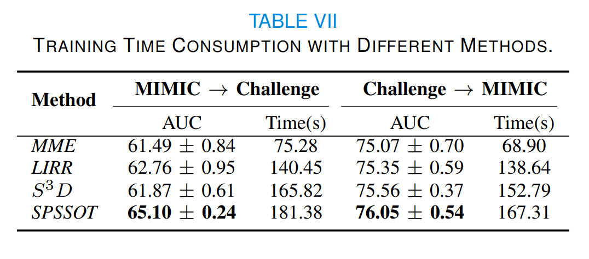

# SPSSOT

Semi-supervised Optimal Transport withSelf-paced Ensemble for Cross-hospital SepsisEarly Detection

## Supplemental Results ([full paper](./SPSSOT_full.pdf) [appendix](./SPSSOT_Appendix.pdf))

### A. Training Time Consumption

**Table VI** reports the training time consumption and AUC values of *SPSSOT* with different batch sizes. Though the optimal transport algorithm and the group entropic loss calculation have high complexity (super-quadratically with the size of the sample), the training usually takes only a few minutes because of the multiple rounds of minibatch iterative optimization [1,2]. Therefore, we can find that as the batch size increases, the training time increases, but the AUC value does not change significantly. In other words, a larger batch size does not necessarily lead to a higher yield. Therefore, we choose 128 as the batch size of *SPSSOT*.

At the same time, **Table VII** compares the training time of different semi-supervised transfer learning methods. The time consumption of our method is comparable to that of baselines. Considering that our method can achieve the best performance, such time consumption is generally acceptable in practice.





### B. Synchronous Self-paced Downsampling

In general, we want to downsample the samples without Sepsis to make the dataset more balanced. However, downsampling unlabeled data is non-trivial as we do not know their labels. In *SPSSOT*, we only consider obtaining balanced training data from the source and target labeled data. Here we further explore whether downsampling the unlabeled data is effective. 

We design a strategy to downsample the labeled and unlabeled data synchronously based on the widely-used stratified sampling technique [3]. 
The basic idea is to use the currently-trained model to predict unlabeled data, and then downsampling the unlabeled data according to prediction probabilities. In particular, we modify *SPSSOT* to achieve synchronous downsampling of labeled and unlabeled data in the self-paced ensemble process, named *S^2PSSOT*: 
(i) iterate 1000 times with all the data to obtain the initialized base classifier SSOT; 
(ii) obtain the prediction probability of 79\% unlabeled data by the base classifier, split them into 10 bins according to prediction probabilities, and keep the proportion of downsampled unlabeled data in each bin is consistent with downsampled labeled data; 
(iii) iteratively train 1000 times with the downsampled data and go back to step (ii).
We repeat steps (ii) \& (iii) five times for getting the final model. 

The detailed algorithm flow is shown in **Algorithm 3** (line 13 to 17 is to downsample the target unlabeled data).


As illustrated in **Table VIII**, there is no significant improvement of the new *S^2PSSOT* compared to the original *SPSSOT*. The possible reason is that the prediction probabilities of the unlabeled data still have uncertainties and thus the prediction-probability-based unlabeled data downsampling may not achieve the ideal data balancing effect. We believe this is an open and interesting question worthy of further exploration.

   


### C. Analysis of Outlier Disturbance

The self-paced sampling in *SPSSOT* has filtered out some noise samples through self-paced hardness harmonization. In general, the outliers would not affect the calculation of class centers.
To confirm this, we also use a popular outlier detection algorithm, the isolation forest algorithm [4], to filter out the outliers before calculating the class centers.
As shown in **Table IX**, adding an explicit step of outlier removal has no noticeable effect on the results. Thus, as expected, the outliers do not seriously affect the accuracy of the calculation of class centers in *SPSSOT*.


### D. The selection of $\rho$ in Label Adaptive Constraint

In Eq.(3), we adapt a parameter, $\rho$, to adjust the transport cost between two samples with the same label; especially when $\rho = 0$, the transport cost is 0; when $\rho =1$, the transport cost is calculated only according to the similarity of features (same as the unsupervised setting). We set $\rho = \{0, 0.05, 0.1, 0.2, 0.4\}$ and conduct experiments. The results are shown in **Table X**.  It can be observed that when $\rho$ is small (between 0 to 0.1), the performance is better and relatively stable; then as $\rho$ increases, the AUC shows a slow downward trend. This indicates that in our task, it is better to set a small value to $\rho$, and setting $\rho = 0$ (i.e., ignoring the transport cost if two samples have the same label) is also reasonable.  In *SPSSOT*, we set $\rho$ to 0.1 and 0.05 for MIMIC $\to$ Challenge and Challenge $\to$ MIMIC, respectively.


### E. Unmatched Features

In *SPSSOT*, we filter out the shared features of two domains (listed in **Table I**) and adopt a domain-shared feature generator $\mathcal{G}$.  However, both datasets have their own private features, which are enumerated in **Table XI**. Considering that our task is a transfer learning setting, we discuss the private features for the target domain and source domain separately.


#### Target private features
Considering target private features may be helpful to the target classification task, we design new network structures to incorporate these features (as shown in **Fig. 10**): 
- add a feature encoder $\mathcal{G}_{pri}$ for private features (the structure is the same as $\mathcal{G}$); 
- concatenate the output of $\mathcal{G}_{pri}$ and the output of $\mathcal{F}$'s first layer; 
- take the concatenation as the input of a new target classifier $\mathcal{F}_{new}$.
After training *SPSSOT*, we transfer the parameters of *SPSSOT* and randomly initialize parameters in other components, and then update parameters with the target labeled data. In brief, we finetune *SPSSOT* by the target labeled data with full features (i.e., shared and private features).


As illustrated in **Table XII**, we can find that there is a significant improvement in Challenge $\to$ MIMIC but no significant change in MIMIC$\to$Challenge. This may be because Challenge only has two private features which are not important.


#### Source private features
Transferring the knowledge from source private features for the prediction in the target domain is non-trivial. The optimal transport technique is hard to directly apply to source private features, as no corresponding features exist in the target domain (so feature similarity cannot be appropriately calculated between a source sample and a target sample). To address this issue, it may require incorporating more transfer learning techniques, e.g., knowledge distillation [5].


### Reference

[1] Deepjdot: Deep joint distribution optimal transport for unsupervised domain adaptation, ECCV (2018).

[2] Reliable weighted optimal transport for unsupervised domain adaptation, CVPR (2020).

[3] Stratified sampling. Statistics Reference Online (2014).

[4] Isolation forest. ICDM (2008).

[5] Distilling knowledge from publicly available online emr data to emerging epidemic for prognosis. WWW (2021).


## Run Model ([Code](https://github.com/RuiqingDing/SPSSOT))

### Requirements

We run the code with Python 3.8, tensorflow 2.4.

All the requirements have been listed in `requirements.txt`.

### Dataset & Preprocessing

Here we give the data link and preprocessing method.

**Basic idea**：

- calculate the max, min, mean, std, last of all clinical indicators in 6 hours
- select patients whose missing features percentage is below 20%

#### MIMIC-III

link: https://physionet.org/content/mimiciii/1.4/

Sepsis labeling: https://github.com/alistairewj/sepsis3-mimic

#### Challenge

data link: https://physionet.org/content/challenge-2019/1.0.0/

After preprocessing, data can be placed under `data` file. Taking `mimic` as an example, subfile `1-79` means the percentage of labeled data is 1% and unlabeled data is 79%, while mimic_test.csv means the data for testing.

### Run SPSSOT

```python
 python SPSSOT_run.py --percent 1-79 --source challenge --target mimic --gloss 0.5 --sloss 1.0 --closs 0.15 --ot_alpha 0.1
```

where

- `percent`: file name which means the percentage of labeled / unlabeled target data
- `source`: source data
- `target`: target data
- `gloss`: the weight of group entropic loss
- `sloss`: the weight of target classification loss
- `closs`: the weight of centroid untilization
- `ot_alpha`: the weight of optimal transport
